# Структури даних та алгоритми

## Лабораторна робота №1

### Розгалужені алгоритми

---

### Виконав

**Студент групи:** ІО-63  
**Котов Роман Дмитрович**  
**Номер у списку групи:** 11

### Перевірив

**Русінов Володимир Володимирович**

---
## Мета лабораторної роботи

Метою лабораторної роботи «Розгалужені алгоритми» є засвоєння теоретичного матеріалу та набуття практичних навичок використання керуючих конструкцій розгалуження та булевих (логічних) операцій.
---

## Завдання

Задано дійсне число `x`. Визначити значення заданої за варіантом кусочно-неперервної функції `y(x)`, якщо воно існує, або вивести на екран повідомлення про неіснування функції для заданого `x`.

### Необхідно розв'язати задачу двома способами:

**1.** У програмі дозволяється використовувати тільки одиничні операції порівняння (`=`, `<>`, `<`, `<=`, `>`, `>=`) і не дозволяється використовувати булеві (логічні) операції (`not`, `and`, `or` тощо).

**2.** У програмі необхідно обов'язково використати булеві (логічні) операції (`not`, `and`, `or` тощо). Використання булевих операцій не повинно бути надлишковим.

---

---
## Блок-схема — варіант 11, програма 1

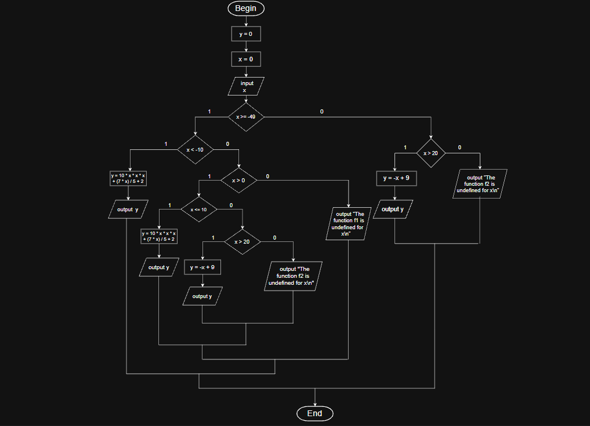
---
## Блок-схема — варіант 11, програма 2

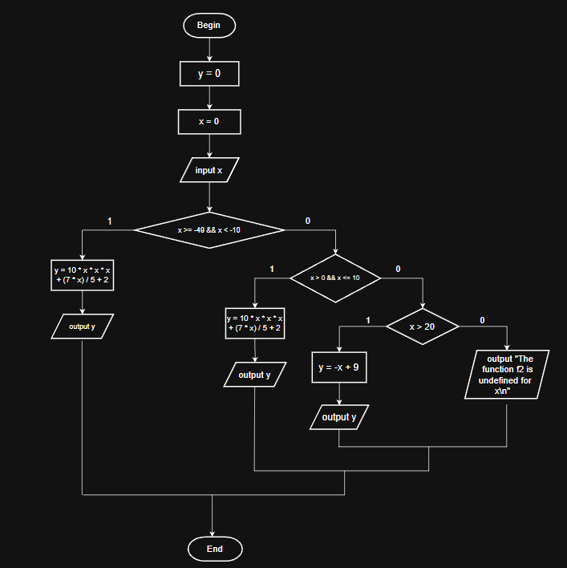
---
## Тестування програми 1

## 1
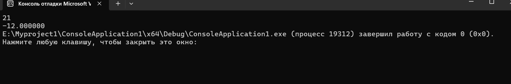
## 2
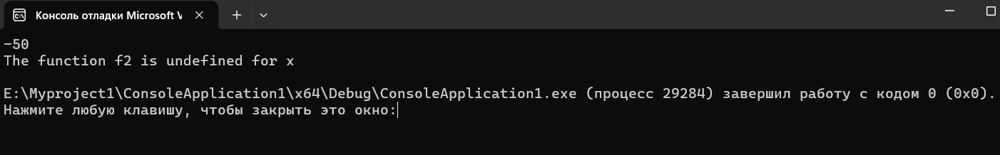
## 3
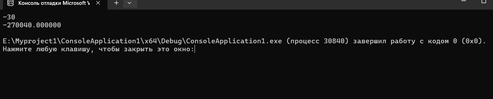
## 4
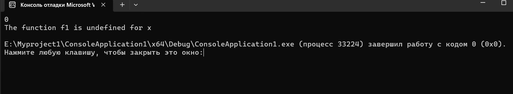
## 5
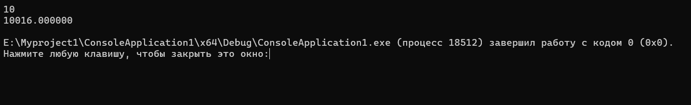
---
## Тестування програми 2

## 1
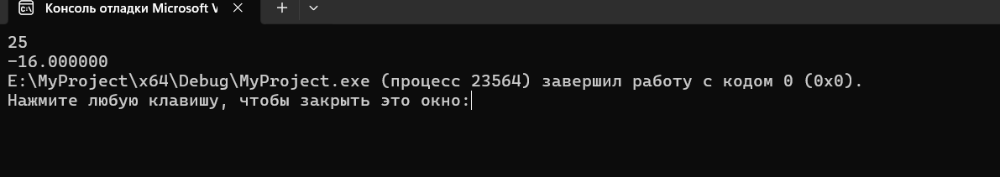
## 2
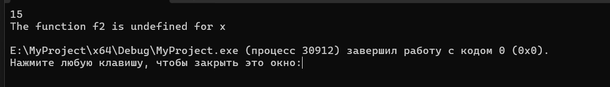
## 3
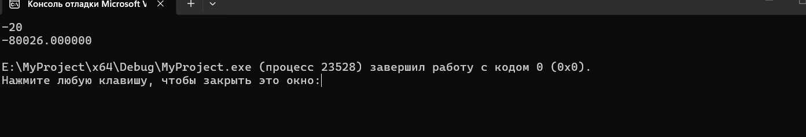
## 4
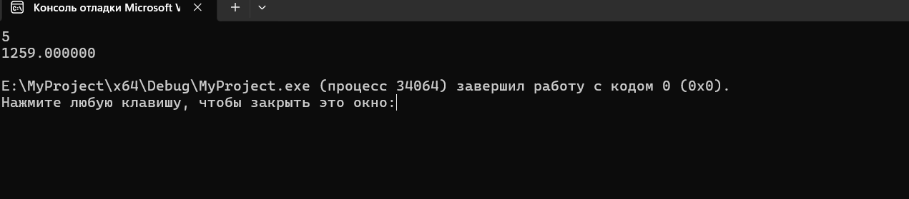
---
## Висновок: Під час виконання лабораторної роботи я навчився використовувати розгалуження в мові C та логічні операції. Було написано дві програми для знаходження значення функції при різних значеннях x. Також я перевірив роботу програм за допомогою тестів і переконався, що вони правильно обробляють різні випадки.
